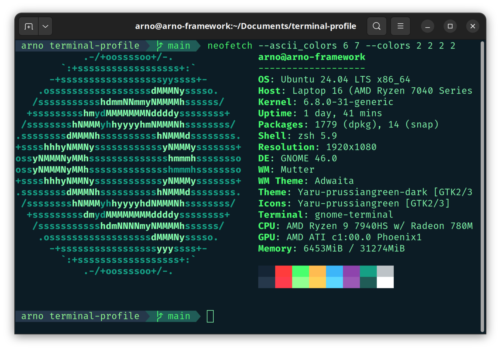

# Pixegami Terminal Profile



# Prerequisites

For the scripts to work, these are the bare minimum requirements.

```bash
# Update your software repositories.
sudo apt-get update
sudo apt-get upgrade

# Install Git.
sudo apt-get install -y git

# Install Vim.
sudo apt-get install -y vim
```

# Installation

### Fira Code

Install Fira Code which is used in the terminal theme.

```bash
sudo apt install fonts-firacode
```

### ZSH, OhMyZSH and Plugins

The shell is "ZSH", with the OhMyZSH upgrade on top of that. To install all of that stuff,
you can run the helper script (and may need to restart after).

```bash
./install_terminal.sh
```

After this, the terminal should look a bit different, but we need to do the next step to have the
entire theme.

### Profile (plugins, theme, font and color)

This script will first install two plugins: auto-complete and color highlighting.

It will also copy over the `.zshrc` and `pixegami-agnoster.zsh-theme` files for the
terminal to use (which will wire up the plugins and the theme).

The last command is to create a terminal profile that will set the colors and also set the font
to be the Fira Code one we installed earlier (required for the theme to display correctly).

```bash
./install_profile.sh
```

